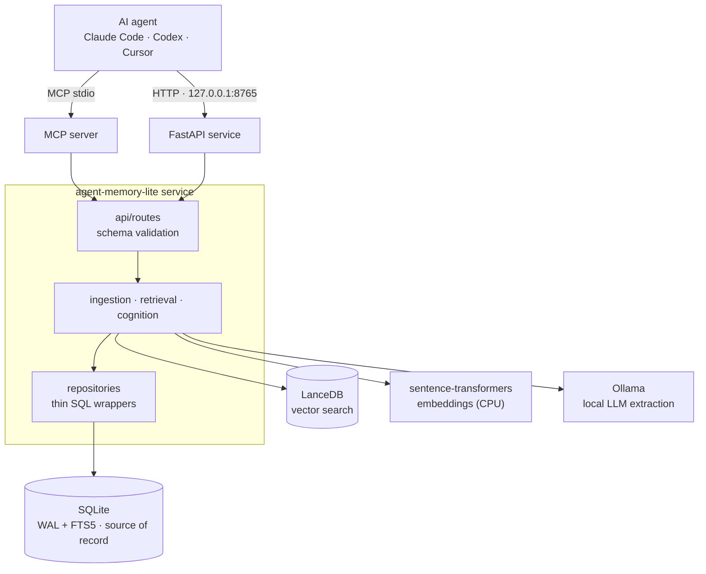
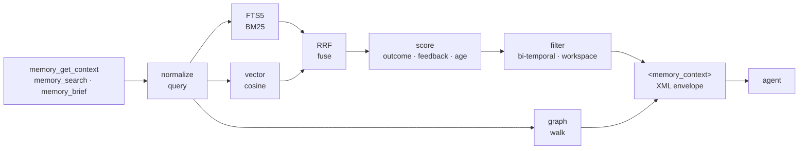
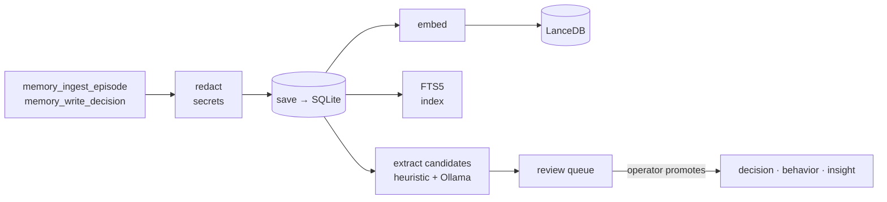

# agent-memory-lite


**Persistent, local-first memory for AI coding agents.** It gives an agent —
Claude Code, Codex, Cursor, or any MCP client — a memory that survives across
chat sessions: decisions, theories, episodes, code knowledge, and learned
behavior.

Runs from one virtualenv on Windows / macOS / Linux. No Docker, no Postgres,
no cloud LLM / embedding / vector providers. SQLite (WAL + FTS5) is the source
of record, LanceDB powers embedded vector search, sentence-transformers does
embeddings on CPU, and a local Ollama model drives candidate extraction.

> **Memory as a brain, not a library.** Every stored row carries an
> `outcome_score`; co-retrieved items grow Hebbian `soft_edges`; a background
> "sleep" pass consolidates recurring episodes into insights and behaviors;
> bi-temporal validity drops superseded knowledge from the active view — see
> [the 8 brain loops](#the-8-brain-loops).

---

## Architecture



The service exposes two equivalent surfaces — an **HTTP API** on
`127.0.0.1:8765` and an **MCP stdio server** — and never opens a non-loopback
socket. Each project gets its own SQLite + LanceDB pair; `workspace_id` is the
logical namespace inside it.

## How a read works

When an agent asks for context, the retrieval pipeline fuses keyword and
vector search with Reciprocal Rank Fusion, re-scores the hits by outcome /
feedback / age, and drops bi-temporally-expired rows. Graph-walked facts join
as a separate structured section, and the result returns as one XML envelope.



## How a write works

After a task the agent records an episode or a decision. Text is redacted
before it ever touches disk, then embedded, FTS-indexed, and mined for
candidate decisions / theories / behaviors that wait in a review queue until
an operator promotes them.



---

## Quick start

```bash
# 1. install — one venv, no Docker
python -m venv .venv
# Windows: .venv\Scripts\activate   ·   Unix: source .venv/bin/activate
pip install -e ".[dev]"

# 2. start the service — auto hub mode once a project is registered
python scripts/serve.py

# 3. attach a project — makes it memory-aware
python scripts/setup_agent.py --project /path/to/your/project

# 4. open an agent chat inside that project — memory auto-loads
# 5. inspect at http://127.0.0.1:8765/ui
```

`setup_agent.py --project` is idempotent: it bootstraps the project's
`.agent_memory/` database, writes the MCP server entry into
`.claude/settings.json`, drops the agent contract into `CLAUDE.md` / `AGENTS.md`,
installs the context-injection hook, and registers the workspace. Re-run it
any time.

Ollama is recommended but optional — set `OLLAMA_PROBE_SKIP=true` to run with
the heuristic extractor only:

```bash
ollama pull qwen2.5:7b-instruct
```

## Requirements

- **Python 3.13** recommended (3.12 / 3.14 also supported; `torch` wheels may
  lag on the newest Python).
- **Ollama** for LLM-driven extraction — optional, skippable with
  `OLLAMA_PROBE_SKIP=true`.
- First run downloads the sentence-transformers embedding model from
  HuggingFace once (a one-time bootstrap, like `ollama pull`); pre-pull it and
  set `HF_HUB_OFFLINE=1` for a strictly air-gapped runtime.
- Windows / macOS / Linux.

---

## Key concepts

**Workspaces & isolation.** Each project is one workspace with its own
database. A project chat can *read* any registered workspace but can only
*write* its own — strict isolation by default. Open a chat in a parent
directory for cross-project ("hub") access.

**What memory stores** — first-class object kinds, not just text blobs:

| Kind | What it is |
|---|---|
| `episode` | Audit log — what the agent did, redacted |
| `decision` | A committed architectural / operating choice |
| `theory` | A claim still gathering evidence (+ experiments, snapshots) |
| `insight` | A reusable lesson distilled from recurring episodes |
| `concept` | Shared domain vocabulary |
| `role` / `skill` / `playbook` | Reusable execution knowledge |
| `behavior_instruction` | How the agent should communicate / operate |

**The agent surface.** Compact-projection tools are the documented path:
`memory_brief`, `memory_search`, `memory_get`, `memory_write`, `memory_edit`,
`memory_pin`, `memory_archive`, `memory_impact_check`, `memory_lint`,
`memory_invoke_skill`. Each returns ~20-40 tokens per item; full content is
opt-in. Full schemas: [`docs/MEMORY_API.md`](docs/MEMORY_API.md).

### The 8 brain loops

A single trigger-on-traffic pass runs eight idempotent, individually
flag-gated background loops (all default ON, byte-equivalent rollback):

1. **Outcome** — every row gets `outcome_score ∈ [-1, +1]` from feedback + age.
2. **Hebbian** — co-retrieved pairs grow `soft_edges`.
3. **Consolidation** — recurring episodes become insights; recurring insights
   become pinned behaviors.
4. **Reflexes** — PreToolUse rules that flag missing preconditions.
5. **Self-model** — a per-workspace identity narrative, refreshed from top
   decisions.
6. **Bi-temporal** — `valid_from` / `valid_to` so expired knowledge drops out.
7. **Recall** — spreading activation over soft / capability / causal edges.
8. **Vector prune** — drops orphan vectors left by a SQLite/LanceDB delete split.

## The browser UI

A live observatory at `http://127.0.0.1:8765/ui` — eight pages sharing a
workspace dropdown:

- **`/ui`** — Observatory: live graph, self-model card, watch-outs
- **`/ui/code`** · **`/ui/graph`** — file / symbol dashboard + code graph
- **`/ui/recall`** — spreading-activation explorer
- **`/ui/reflexes`** — reflex-rule editor
- **`/ui/metrics`** — outcome distribution, Hebbian edges, causal links
- **`/ui/review`** — candidate promote / reject queue
- **`/ui/browse`** — generic browser over decisions / theories / insights

---

## Local-only guarantee

No cloud LLM, embedding, or vector provider — ever. The startup guard rejects
non-loopback `*_BASE_URL`s and an unconditional cloud-provider denylist
(`api.openai.com`, `api.anthropic.com`, …); `ruff` bans cloud SDK imports at
lint time. `LOCAL_ONLY=false` + `ALLOW_REMOTE_PROVIDERS=true` relax only the
loopback check (for an on-prem non-loopback host) — the cloud denylist is
never disabled.

Optional bearer-token auth guards `/memory/*` when
`MEMORY_REQUIRE_API_TOKEN=true`; `/health` stays open for monitoring.

## Develop

```bash
pytest -q                              # unit / property / integration / e2e tests
ruff check src tests scripts           # lint
ruff format --check src tests scripts  # format
mypy src                               # types
python scripts/check_sloc.py --enforce # 150-SLOC-per-module ceiling
```

Source files are capped at ~150 SLOC, one concern per module — mono-files
become subpackages. Migrations are forward-only. A pre-push hook runs a
27-phase crash test against an isolated workspace before any push to `main`.

## Documentation

| Document | What's in it |
|---|---|
| [`docs/README.md`](docs/README.md) | Documentation map — read this first |
| [`docs/AGENT_CONTRACT.md`](docs/AGENT_CONTRACT.md) | Canonical agent operating contract |
| [`docs/AGENT_CHEATSHEET.md`](docs/AGENT_CHEATSHEET.md) | One-page when-to-call-what |
| [`docs/MEMORY_API.md`](docs/MEMORY_API.md) | Every HTTP endpoint + MCP tool schema |
| [`docs/OPERATIONS.md`](docs/OPERATIONS.md) | Operator runbook — scripts, upgrades, troubleshooting |
| [`docs/MEMORY_SCHEMA.md`](docs/MEMORY_SCHEMA.md) | Database schema |
| [`CHANGELOG.md`](CHANGELOG.md) | Per-release notes |
| [`CLAUDE.md`](CLAUDE.md) | Repo invariants + layered architecture |

For the laziest setup, paste an [`AGENT_SETUP/`](AGENT_SETUP/) prompt into a
fresh chat and the agent wires everything itself.

## Status

**v3.7.1** (2026-05-22). The "memory as a brain" core shipped in the 3.0.0
line; 3.1–3.7 added the research vectors, MemBench retrieval benchmarks, an
8-sector adversarial audit, the orphan-vector prune loop, and a hub-mode
cross-workspace write guard on the ingest routes. Every feature is on by
default, with a flag-off path locked byte-equivalent by `tests/invariants/`.

## License

MIT.
