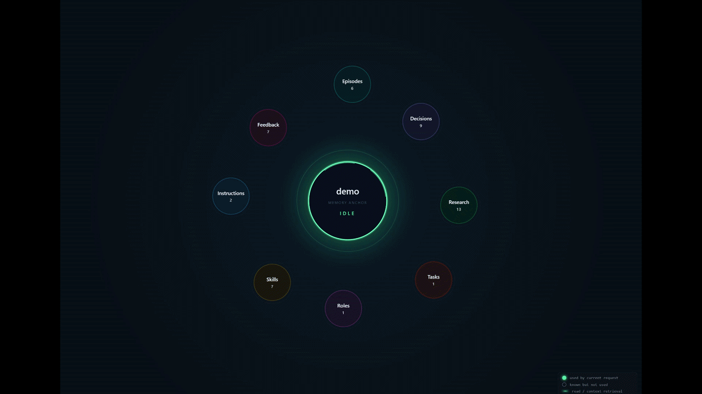

# agent-memory-lite



> Live observatory — every memory operation drawn as a one-shot
> animation cycle: family bubbles light up, spokes radiate to the
> objects touched, the trail rolls one row per request. Above is a
> 50-second carousel hitting all 15 endpoint categories (search,
> ingest, write_decision, pin, upsert concept/skill, link_capability,
> archive, accept/reject candidate, update_task_state, explain).

**Local memory subsystem for an AI agent.** Runs from a virtualenv on Windows /
macOS / Linux. No Docker, no Postgres, no cloud LLM / embedding / vector
providers. SQLite (WAL + FTS5) is the source of record; LanceDB powers
embedded vector search; sentence-transformers handles embeddings on CPU;
Ollama drives local LLM extraction.

> **3.0.0-final — memory as a brain, not a library.** Every retrievable
> row carries `outcome_score ∈ [-1, +1]` derived from feedback; co-
> retrievals form Hebbian `soft_edges` (with HeLa-Mem outcome gate);
> sleep consolidation distills `insights` and promotes recurring ones
> to pinned behaviors; PreToolUse `reflex_rules` can block tool calls
> on missing preconditions; a per-workspace `self_model` surfaces
> identity narrative first in every brief; bi-temporal `valid_from/
> valid_to` filtering keeps superseded knowledge from the active view;
> `memory_recall(topic, depth, outcome_floor)` does spreading
> activation over `soft_edges ∪ capability_links ∪ causal_links`.
>
> Plus the v3 compact-projection surface (10 strict tools, ~20-40
> tokens per item, full content via `fields=`) and a brain-aware
> dashboard at `/ui` (Observatory) + `/ui/recall` + `/ui/reflexes` +
> `/ui/metrics`. Every phase is flag-gated for byte-equivalent
> rollback.
>
> **One-line deploy** (canonical path):
>
>     python scripts/setup_agent.py --project /path/to/your/project
>
> This applies the canonical schema + the 7 brain migrations
> (0002-0008), seeds the 3 pinned discipline rules (graph-tools-first
> / search-before-write / capability-link-on-write) + the 3 baseline
> reflex rules (advisory enforcement), wires the `UserPromptSubmit`
> brief hook + `PostToolUse` digest hook + `PreToolUse` enforcement
> hook into `.claude/settings.json`, and registers the workspace in
> `~/.agent_memory/workspaces.json`. Idempotent — safe to re-run.
>
> See [`docs/MEMORY_AGENT_RUNTIMES.md`](docs/MEMORY_AGENT_RUNTIMES.md),
> [`docs/MEMORY_SCHEMA.md`](docs/MEMORY_SCHEMA.md), and
> [`docs/MEMORY_MIGRATION.md`](docs/MEMORY_MIGRATION.md) for wiring +
> cutover playbook.

> **2.0.0 — first public-facing release.** Local-first memory
> substrate (SQLite + LanceDB + sentence-transformers + Ollama, no
> cloud, no Docker) with first-class decisions, theories,
> snapshots, experiments, concepts, insights, roles, skills,
> playbooks, behavior instructions, and memory candidates. The
> four adoption-by-default Moves (auto-thread `source_episode_id`,
> compound `record_with_evidence`, `capability_suggestions` on
> decision and theory writes) make the discipline rules
> server-defaulted instead of agent-remembered. Code-memory
> substrate ships eight language-aware MCP tools
> (`memory_find_symbols`, `memory_graph_neighbors`,
> `memory_breaking_changes`, `memory_file_digest`,
> `memory_code_overview`, `memory_code_graph`,
> `memory_symbol_history`, `memory_soft_neighbors`) plus the three
> multi-agent edit primitives. The correction-aware learning loop
> closes the "operator corrects agent → lesson dies" gap with a
> review queue + one-click promote to `behavior_instruction`. See
> [`CHANGELOG.md`](CHANGELOG.md) for full
> release notes and [`docs/CODE_MEMORY_GUIDE.md`](docs/CODE_MEMORY_GUIDE.md)
> for the operator-facing guide.

**New to the project?** Read [`docs/README.md`](docs/README.md) for the
documentation map: which file holds what, in what order to read, and where
the per-release archaeology lives.

## What it does — in one picture

```
┌──────────────────────────────────────────────────────────────────────────┐
│  Agent (Claude Code / Codex / Cursor / your own MCP client)              │
│                                                                          │
│   ① before a task                  ② during the task                     │
│      memory_get_context  ─────▶       memory_search / memory_get_object  │
│      memory_what_references           memory_list_{decisions,theories,   │
│      memory_review_queue              candidates,behavior_instructions,  │
│      memory_explain_context           agent_capabilities,research_agenda,│
│                                       capability_links,maintenance,audit}│
│                                                                          │
│   ③ after the task                                                       │
│      memory_ingest_episode ◀──   redaction → embed → FTS → extract       │
│      memory_ingest_file           ──▶ candidates queue → review/promote  │
│      memory_write_decision        ──▶ snapshot_save / archive / pin      │
│      memory_write_theory          memory_link_capability                 │
│      memory_write_experiment      memory_upsert_{concept, behavior,      │
│      memory_register_snapshot     agent_role, agent_skill, playbook}     │
│      memory_distill_insight       memory_compact_trigger / compact       │
│                                                                          │
│  ▼                                                                       │
│  HTTP 127.0.0.1:8765   ◀── auto-injected via UserPromptSubmit hook;      │
│                            unregistered cwd auto-falls-back to a shared  │
│                            ~/.agent_memory/global/ workspace             │
│  MCP stdio             ◀── registered per-project by setup_agent.py     │
│                                                                          │
│  ▼                                                                       │
│  ┌────────────────────────────────────────────────────────────────────┐ │
│  │   <memory_context>  (XML envelope returned to the agent)            │ │
│  │     <core_memory> local-only; never call cloud LLMs ...             │ │
│  │     <behavior_instructions> evidence-first reports ...              │ │
│  │     <task_state task_id=... status=in_progress>                     │ │
│  │       <next_action> ... </next_action> (only when task_id is sent)  │ │
│  │     </task_state>                                                   │ │
│  │     <active_decisions> Architecture: local-only embedding ...       │ │
│  │     <active_theories> Source-flip favorites carry edge ...          │ │
│  │     <research_agenda> snapshots / experiments / insights ...        │ │
│  │     <agent_capabilities> Replay-and-backtest skill ...              │ │
│  │     <procedural_rules> always run pytest before commit ...          │ │
│  │     <retrieved_facts> graph-walked entity relations                 │ │
│  │     <retrieved_chunks> RRF hybrid (FTS + vector cosine);            │ │
│  │       each <chunk sources="ep_xxx,ep_yyy"> traces back to its       │ │
│  │       source episode(s) — episodes themselves are not a separate    │ │
│  │       envelope section, they surface here when relevant             │ │
│  │   </memory_context>                                                 │ │
│  └────────────────────────────────────────────────────────────────────┘ │
└──────────────────────────────────────────────────────────────────────────┘
       │                │                │                  │
       ▼                ▼                ▼                  ▼
┌────────────┐  ┌────────────┐   ┌────────────┐    ┌──────────────────┐
│  SQLite    │  │  LanceDB   │   │  Ollama    │    │ sentence-trans-  │
│  (WAL +    │  │  vector    │   │  (local    │    │ formers (e5-     │
│  FTS5)     │  │  store     │   │  qwen2.5)  │    │ small, CPU)      │
│            │  │            │   │            │    │                  │
│  36 tables │  │  per-WS    │   │  candidate │    │  384-dim vectors │
│  per WS    │  │  namespace │   │  extraction│    │  for chunks      │
└────────────┘  └────────────┘   └────────────┘    └──────────────────┘
```

**Episodes / tasks access pattern.** Episodes are the agent's audit log;
they are chunked + indexed and surface inside `<retrieved_chunks>` when
their content is relevant to the query (the `sources` attribute traces
each chunk back to its episode_id). For direct lookup use
`memory_search(query=…, mode="fts")`,
`memory_get_object(kind="episode", id="ep_…")`,
`memory_what_references(target_id="ep_…")`, or
`memory_list_audit(target_type="episode", target_id="ep_…")`.
`<task_state>` renders only when the request carries a `task_id`; query
the task state explicitly with `memory_update_task_state` (which also
returns the current state) or via the audit log for one task.

### Live observatory at `/ui`

A local browser observatory at `http://127.0.0.1:8765/ui` shows the
request flow as it happens. Layout:

- **Centre:** workspace anchor (current `workspace_id`) with the active
  cycle phase (RECALL → FUSE → ANSWER → RELEASE).
- **Around the anchor:** eight family orbs — Decisions, Research,
  Episodes, Skills, Roles, Instructions, Tasks, Feedback. Each one
  shows its total row count.
- **Spokes:** one per object pulled into the active query. Spoke +
  node colour encodes the action (see the in-UI legend bottom-right):
  green = create / upsert / restore, yellow-green = pinned, amber =
  unpinned, red-orange = archived, red = deleted / rejected,
  family-hue = read.
- **Right rail:** ASK MEMORY (search / explain), live trail of the
  last ~80 SSE events grouped by request_id, and an inspector panel
  that opens when you click a family bubble.
- **Inspector:** lists the family's top items. Auto-refreshes on
  every write (no F5 needed). Click a row to open the object body
  with Pin / Archive buttons.
- **Workspace dropdown:** top-right. Pick any registered workspace
  to switch context without restarting the service. In hub mode the
  same service serves every project.

## Status — 3.0.0

Latest tag: **v3.0.0** (2026-05-19) — memory as a brain. Outcome-aware
retrieval, Hebbian associations, PreToolUse reflexes, identity self-
model, bi-temporal facts, spreading-activation recall. See
[`docs/AGENT_CONTRACT.md`](docs/AGENT_CONTRACT.md) for the 7-phase
breakdown. The 2026-05-19 agent-UX follow-ups (registry-routed MCP
handlers, sticky-brief, Move 5 ``decision_neighbors``, aging-decision
ping, deprecation-notice dedup) land on top of the 3.0.0 line.
Every memory feature is on by default;
flag-off parity invariants in `tests/invariants/` lock the legacy
byte-equivalent path for any operator who wants to peel a layer
off. The pre-2.0.0 incremental development history is preserved
verbatim in [`docs/CHANGELOG_LEGACY.md`](docs/CHANGELOG_LEGACY.md)
for traceability.

For the full breakdown see [`CHANGELOG.md`](CHANGELOG.md). The
incremental development trail (1.x → 2.1.x → 2.2.x) that produced
2.0.0 is preserved in
[`docs/CHANGELOG_LEGACY.md`](docs/CHANGELOG_LEGACY.md) for
historical trace.

What 2.0.0 includes (every flag default ON; flag-off parity is
locked by `tests/invariants/`):

- **Adoption-by-default Moves 1–4** — server auto-threads
  `source_episode_id` from the agent's most recent
  `ingest_episode`, ships `memory_record_with_evidence` as the
  atomic compound write, and surfaces `capability_suggestions` on
  every decision and theory write across HTTP, MCP stdio, and
  in-process MCP.
- **Feedback-aware retrieval scoring** — EWMA term over
  `memory_usage_feedback`, derived automatically from operator
  actions (archive→-1.0, promote→+0.7,
  link_capability→strength). Calibrated against real workspace
  traffic: 1370 audit entries → 158 implicit feedback rows, 95%
  rank churn, low-EWMA cohort dropped 26 places, biggest faller
  -51.
- **Capability maturity + behavior tracking** — usage / success
  counters on roles / skills / playbooks; `application_count`
  advances on every envelope render that surfaces an instruction.
- **Cold-memory lifecycle** — retrieval stamps
  `last_retrieved_at` on top-K (batched audit, batch_size=100);
  cold scanner emits `cold_candidate` events for rows untouched
  > `MEMORY_COLD_STALE_DAYS=60`. Human-driven archival via the
  review queue.
- **Theory → decision_candidates bridge** — validated theories
  with ≥3 evidence rows surface as pending decision candidates.
  Trust gate intact; never auto-promotes.
- **Reflective compaction** — `/memory/compact` runs an Ollama
  pass over recent episodes and proposes lessons into
  `insight_candidates`. Gracefully degrades when Ollama
  unreachable.
- **Hygiene recurrence + sentinel persistence** — hygiene
  findings and watchdog runs persisted with recurrence counts.
- **Pending-review envelope** — every `memory_get_context`
  injects a `<pending_review>` XML block carrying every field an
  agent needs to promote / reject without an extra
  `/memory/list_candidates` round-trip.
- **Trigger-on-traffic sentinel scheduler** — each
  `get_context` triggers a background sentinel pass when overdue
  (default 6h). Per-workspace lock prevents duplicate concurrent
  daemons. Hub-mode aware: `db_path` resolved from the
  request-scoped connection via `PRAGMA database_list`.
- **MCP-HTTP parity** — `apply_post_build_hooks()` in
  `api/routes/context_post_build.py` is the single chokepoint
  for every envelope hook. Both the HTTP route and the MCP stdio
  local fallback call it, so MCP-only deployments fire every
  feature the same way HTTP does. The same parity guarantee
  applies to `memory_write_decision` /
  `memory_write_theory` (via the shared
  `ingestion/_write_helpers.py`) so a downed HTTP service does
  not silently drop Move 1 / Move 3 / Move 4 fields.
- **Correction-aware learning loop** — `UserPromptSubmit` hook
  reads the Claude Code transcript JSONL, finds the previous
  assistant turn, and ingests claim+correction as two
  cross-referenced episodes when the current prompt matches the
  heuristic. The `CorrectionExtractor` emits
  `memory_candidate(kind=correction)` for review; operator
  promotes via `memory_promote_candidate_to_behavior` to land a
  durable `behavior_instruction`.
- **Hook reliability** — UTF-8 stdout reconfigure (no more
  `UnicodeEncodeError` on Windows cp1251 / cp1252 console),
  visible `<hook_notice severity="warn" code="global_fallback">`
  block when the cwd Claude Code reports doesn't match any
  registered project_root, so the agent sees the real reason an
  envelope is empty instead of staring at self-closing skeleton
  tags.

Carried over from 1.0.3: 18+ persistence kinds (episodes, chunks, files,
decisions, theories, experiments, snapshots, insights, concepts,
roles / skills / playbooks, behavior_instructions, core_memory,
procedural_rules, etc.); RRF retrieval (FTS BM25 + vector cosine + graph)
with discover-then-fetch index blocks; operator surface
(pin / archive / what_references / list_audit / state snapshots /
review_queue / compact_trigger); hub mode + asymmetric isolation;
live observatory at `/ui`.

Quality bar: **633 tests** (unit / property / integration / e2e — was 491
in 1.0.3 baseline), strict ruff + mypy + 150-SLOC ceiling per source
file, forward-only migrations (0001 + 0020-0025 chained on top), local-
only guard against cloud SDK imports. Calibration evidence in
`docs/V1_1_0_CALIBRATION.md`; operator guide in
`docs/V1_1_0.md`.

## Requirements

- **Python 3.13 recommended** (3.12 supported, 3.14 supported but `torch` wheels may lag).
- **Ollama** required for production LLM-driven extraction. The service refuses to start
  unless Ollama responds at `LLM_BASE_URL`, **or** `OLLAMA_PROBE_SKIP=true` (use the
  skip flag for tests / first-run smoke checks only).
- Windows / macOS / Linux. Paths are normalized; tested on Windows.

## Install

```bash
python -m venv .venv
# Windows: .venv\Scripts\activate
# Unix:    source .venv/bin/activate

pip install -e ".[dev]"
```

If `torch` wheels are unavailable for your Python version, install Python 3.13 alongside
(via `pyenv-win`, `rye`, or the official installer) and recreate the venv.

## Getting started — new user, first run

```
1. clone & install   →  pip install -e ".[dev]"
2. start service     →  python scripts/serve.py        (auto hub mode)
3. attach a project  →  python scripts/setup_agent.py --project /path/to/X
4. open a chat       →  in /path/to/X — agent auto-loads X's memory
5. inspect           →  http://127.0.0.1:8765/ui
```

What each step does:

1. **Install.** One venv, one `pip install`. No Docker, no databases to
   provision. SQLite + LanceDB live next to your project as a `.agent_memory/`
   folder. Ollama is recommended for LLM extraction but optional
   (`OLLAMA_PROBE_SKIP=true` to skip).

2. **Start the HTTP service.** `scripts/serve.py` boots FastAPI on
   `127.0.0.1:8765`. With no projects yet registered it runs in single-anchor
   mode; once at least one project is registered (step 3) it automatically
   switches to **hub mode** so one service can serve many projects. Pass
   `--hub` or `--strict` to override. To autostart on Windows login:

       powershell -ExecutionPolicy Bypass -File scripts/memory_service_task.ps1 \
           -Action Install -WorkspaceId <name> -ProjectRoot <path> -HubMode

3. **Attach a project.** `setup_agent.py --project <path>` does everything
   needed to make a project memory-aware:
   - creates `<path>/.agent_memory/memory.db` and `vectors.lance`,
   - writes `<path>/.claude/settings.json` with an MCP server entry that
     pins `MEMORY_DB_PATH`, `MEMORY_WORKSPACE_ID`,
     `MEMORY_FORBID_DEFAULT_WORKSPACE=true`, and
     `MEMORY_STRICT_WORKSPACE_ISOLATION=true` — the safe project default,
   - installs a `UserPromptSubmit` hook that auto-injects memory context
     before every prompt,
   - drops a copy of the agent contract into `CLAUDE.md` and `AGENTS.md`,
   - registers the project in `~/.agent_memory/workspaces.json` so the hub
     service and UI can route to it.

   Pass `--workspace <id>` to choose a specific name (default: project
   folder name).

4. **Open a chat in the project root.** Any MCP-aware runtime (Claude Code,
   Codex, Cursor) will find the project-scoped MCP server, the agent will
   see memory tools in its tool list, and the hook will auto-prepend
   relevant past context to each prompt.

5. **Inspect.** The UI at `http://127.0.0.1:8765/ui` shows a live graph of
   what's in memory, a workspace dropdown to switch between projects, the
   current request flow, and recent durable changes.

### What's safe by default

When you set up a project with `--project`, the resulting chat enforces
**asymmetric isolation**:

| Operation | Same workspace | Other registered workspace | `default` workspace |
|---|---|---|---|
| **Read** (`get_context`, `search`, `list_*`) | ✅ | ✅ if user explicitly asks | ❌ |
| **Write** (`ingest_episode`, `write_decision`, ...) | ✅ | ❌ blocked by strict guard | ❌ |

In practice: you can ask an agent in project A to *read* project B's
memory ("show me copyBot decisions"), but the agent cannot *write*
anything into project B without you opening a chat there. To get full
cross-workspace access (both read and write), open a chat in the parent
directory — that's a hub chat and it has no strict guard.

See `docs/AGENT_CONTRACT.md` for the full agent operating contract,
including the cross-workspace access protocol and every endpoint.

## Set up Ollama (recommended for full feature set)

```bash
# https://ollama.com/download
ollama pull qwen2.5:7b-instruct
```

The default `LLM_BASE_URL` is `http://127.0.0.1:11434`. Without Ollama, set
`OLLAMA_PROBE_SKIP=true` in `.env` and the heuristic extractor still runs;
LLM-driven candidate extraction is simply disabled until Ollama is reachable.

## Theory memory

Episodes are the audit log: what happened, when, and with what evidence. They
should not be the only place where learning lives. Use **theories** for working
claims that need evidence and experiments:

- `POST /memory/write_theory` records a hypothesis with `claim`, `mechanism`,
  `predictions`, `validation_criteria`, `experiment_plan`,
  `dependent_decision_ids`, `tags`, `status`, `confidence`, and `importance`.
- `POST /memory/add_theory_evidence` attaches supporting, refuting, mixed,
  neutral, or experiment evidence to a theory.
- `POST /memory/list_theories` retrieves the relevant theory set, optionally
  including recent evidence. Responses include `evidence_count` and signed
  `evidence_strength`, so rejected/weak theories remain visible as negative
  knowledge instead of disappearing into episodes.
- `POST /memory/get_context` includes an `<active_theories>` section ahead of
  retrieved chunks, so agents see the current research agenda instead of
  rediscovering it from hundreds of episodes.

## Research-lab memory

Theories say what might be true. The research-lab layer tracks the work needed
to test those theories:

- `POST /memory/register_snapshot` catalogs a data snapshot with SQLite/DuckDB
  paths, table counts, row totals, source, build metadata, and time windows.
- `POST /memory/write_experiment` creates a planned/running test linked to a
  `theory_id` and/or `snapshot_id`, including cohort definition, command, and
  success criteria.
- `POST /memory/add_experiment_result` records the result, marks the experiment
  completed, attaches evidence to the linked theory, updates theory
  confidence/status, and creates a contradiction insight for high-confidence
  refuting or mixed evidence.
- `POST /memory/upsert_concept` stores shared vocabulary for metrics, gates,
  cohorts, and artifacts.
- `POST /memory/distill_insight` promotes lessons from raw episodes into an
  actionable backlog.
- `POST /memory/list_research_agenda` returns the current snapshots, open
  experiments, insights, and concepts for a query.
- `POST /memory/get_context` includes a `<research_agenda>` section after
  `<active_theories>`, so agents see the lab backlog before raw retrieved
  chunks.
- `scripts/research_status.py` prints a one-command report for active theories,
  snapshots, open experiments, insights, concepts, and whether
  `memory_get_context` is surfacing the research sections.

`memory_get_context` query-ranks and caps active decisions before rendering
theories and agenda, so old architectural choices do not bury current research
work as the memory grows. The highest-ranked decisions that remain in context
are rendered with full decision text, and low-confidence stale retrieved chunks
are suppressed unless the caller requests `historical=true` or the hit is an
exact top FTS match.

Use `POST /memory/list_decisions` when you need a topic-level view such as
"decisions about live execution" and do not already know the decision id.

## Agent capability memory

Episodes record what happened. Decisions record what was chosen. Research
objects record what should be studied. Capability memory records how agents
should execute work:

- `POST /memory/upsert_agent_role` stores a role with purpose,
  responsibilities, boundaries, handoff triggers, tools, confidence, and source.
- `POST /memory/upsert_agent_skill` stores a reusable skill with when-to-use
  cues, inputs, outputs, tools, and related roles.
- `POST /memory/upsert_agent_playbook` stores a repeatable workflow with
  triggers, ordered steps, success criteria, and required skills.
- `POST /memory/list_agent_capabilities` retrieves the relevant roles, skills,
  and playbooks for a query.
- `POST /memory/link_capability` links a role, skill, or playbook to a theory,
  evidence item, experiment, insight, candidate, or decision with an explicit
  relation such as `method`, `reviewer`, `critique_lens`, or
  `validation_playbook`.
- `POST /memory/list_capability_links` shows which capabilities influence a
  target object.
- `POST /memory/get_context` includes an `<agent_capabilities>` section after
  `<research_agenda>`, and linked capabilities are rendered inside theories,
  experiments, and insights so roles and skills can directly shape hypothesis
  review and research execution.

Recommended flow:

```text
define role -> define reusable skill -> define playbook
            -> link capability to theory/experiment
            -> verify via get_context
```

Example playbook:

```json
{
  "workspace_id": "<workspace_id>",
  "name": "Non-destructive live audit",
  "goal": "Confirm live flow without changing data.",
  "triggers": ["The user asks whether the live system works"],
  "steps": ["Read memory context", "Check health endpoints", "Report blockers"],
  "success_criteria": ["No reset was performed", "The report cites exact evidence"],
  "required_skills": ["Live flow audit"],
  "confidence": 0.85
}
```

Example capability link:

```json
{
  "workspace_id": "<workspace_id>",
  "target_type": "theory",
  "target_id": "th_...",
  "capability_type": "skill",
  "capability_name": "Replay and backtest design",
  "relation": "method",
  "rationale": "This hypothesis must be tested with replay before policy changes.",
  "strength": 0.9
}
```

## Behavior instruction memory

Procedural rules are still supported for simple durable rules. Use behavior
instructions when the agent should consistently change how it communicates or
operates:

- `POST /memory/upsert_behavior_instruction` stores a named instruction with
  `kind`, `scope`, `priority`, `rule`, `rationale`, `applies_to`,
  `conflict_policy`, confidence, source/review metadata, optional expiry,
  conflict group, and active state.
- `POST /memory/list_behavior_instructions` retrieves relevant behavior
  instructions for review.
- `POST /memory/get_context` includes a high-priority
  `<behavior_instructions>` section directly after `<core_memory>`, before task
  state, decisions, theories, and retrieved chunks.

Supported kinds: `communication_style`, `operating_rule`,
`project_convention`, `workflow_preference`, and `role_guidance`.

Supported conflict policies: `current_user_wins`, `system_wins`,
`higher_priority_wins`, `most_specific_wins`, and `latest_wins`. Store user
preferences with `current_user_wins` unless the rule is a non-negotiable safety
or project constraint. Current user instructions and higher-level system
instructions still outrank stored memory.

Example behavior instruction:

```json
{
  "workspace_id": "<workspace_id>",
  "name": "Evidence-first operational reports",
  "kind": "communication_style",
  "scope": "workspace",
  "priority": "user_preference",
  "rule": "When reporting incidents, lead with exact issue, evidence, fix, and remaining risk.",
  "rationale": "The user needs concrete operational evidence rather than generic status language.",
  "applies_to": ["incident reports", "runtime audits"],
  "conflict_policy": "current_user_wins",
  "source_type": "user_direct",
  "source_id": "chat-20260430",
  "reviewed_by": "operator",
  "reviewed_at": "2026-04-30T00:00:00+00:00",
  "expires_at": null,
  "conflict_group": "incident-report-style",
  "confidence": 0.95
}
```

Expired behavior instructions are suppressed from `memory_get_context`. Use
`/memory/explain_context` to inspect suppressed behavior instructions and
reasons such as `expired`, `inactive`, or `query_mismatch`. Instructions copied
from untrusted external content should stay as review candidates until a human
or trusted agent review assigns safe provenance.

Recommended flow:

```text
register_snapshot -> write_theory -> write_experiment -> add_experiment_result
                                      -> confidence/status update
                                      -> contradiction insight if needed
```

Example experiment result:

```json
{
  "workspace_id": "<workspace_id>",
  "experiment_id": "exp_...",
  "kind": "supporting",
  "summary": "Favorite-side source flips stayed positive after fee assumptions.",
  "metrics": {"n": 144, "net_edge_bps": 31.2},
  "artifact_path": "reports/analitic/source_flip_replay.md",
  "confidence": 0.8
}
```

Example theory:

```json
{
  "workspace_id": "<workspace_id>",
  "title": "Source-flip tennis favorites",
  "domain": "trading.paper.edge",
  "claim": "Source-flip trades on tennis favorites may carry short-lived edge.",
  "mechanism": "The source wallet may react before public odds fully adjust.",
  "predictions": ["favorite-side flips outperform underdog-side flips"],
  "validation_criteria": [
    "minimum 100 settled trades",
    "net edge remains positive after fee assumptions"
  ],
  "experiment_plan": "Replay source-flip fills by sport and side on the latest VPS snapshot.",
  "dependent_decision_ids": ["dec_..."],
  "tags": ["trading-bot", "source-flip", "tennis", "favorite"],
  "status": "testing"
}
```

Use `status="rejected"` for disproven theories. A rejected theory is an
anti-theory: it records that a tempting explanation or edge did **not** survive
measurement. Keep it queryable with refuting evidence and metrics rather than
burying it in an episode.

## Quick verification (≈ 2 minutes, no Ollama needed)

End-to-end check the project ships with: boot the service, seed a
representative session, exercise every public endpoint, run the eval
harness.

```bash
# 1. configure (one-off)
cp .env.example .env
# Either install Ollama (see above) or skip the probe:
sed -i 's/^OLLAMA_PROBE_SKIP=false/OLLAMA_PROBE_SKIP=true/' .env

# 2. unit + property + integration + e2e tests (~3s)
pytest -q

# 3. start a fresh DB and the service
rm -rf .agent_memory
python scripts/bootstrap_db.py
python -m agent_memory_lite          # binds 127.0.0.1:8765 in this terminal

# 4. in a second terminal, smoke-test every route end-to-end:
python scripts/seed_demo_session.py
```

`scripts/seed_demo_session.py` ingests 10 episodes (one with secrets that get
redacted in flight), writes 3 architectural decisions, upserts a task state,
queries `POST /memory/get_context` (the agent-facing surface), runs an exact
FTS lookup via `POST /memory/search`, and finally runs the eval harness via
`POST /memory/run_evals`. The expected outcome:

```
=== POST /memory/run_evals ===
{
  "cases_run": 13,
  "cases_passed": 13,
  "retrieval_recall_at_10": 1.0,
  "retrieval_precision_at_10": 1.0,
  "stale_fact_rate": 0.0,
  "secret_leak_count": 0,
  "prompt_injection_failures": 0,
  "failures": []
}
```

Health check at any time:

```bash
curl http://127.0.0.1:8765/health
```

Local visual UI:

```text
http://127.0.0.1:8765/ui
```

The UI is served by the same FastAPI process. It is a live memory observatory:
the first screen shows the active request moving through input, retrieval,
indexing, ranking, context building, persistence, and response stages. It also
shows a human-readable life feed, a task-context graph for Search/Explain, and
keeps raw XML, table counts, DB/vector paths, and structural object maps inside
Developer details.

The live stream uses process-local, non-durable telemetry. Events are never
written to SQLite:

- `GET /memory/ui/events?workspace_id=<workspace_id>` streams SSE events.
- `GET /memory/ui/state?workspace_id=<workspace_id>` remains backward
  compatible and includes `latest_events`, `graph_deltas`, and
  `active_requests` for polling fallback.
- Search, context/explain, ingest, decision/theory/evidence/capability, task,
  and research write routes emit redacted stage events.

`/health` includes `retrieval_integrity`. A degraded FTS/vector/workspace
manifest/workspace pollution check, open maintenance event, or dangling
capability link changes health status to `degraded`; repair is never automatic.
Candidate/research hygiene problems appear as `warnings` so they are visible
without pretending the retrieval substrate is physically broken.

Read-only audit:

```bash
python scripts/memory_audit.py --workspace <workspace_id> --json
```

Inspect cross-workspace rows before trusting an isolated project DB:

```bash
python scripts/memory_workspace_doctor.py --workspace <workspace_id> --db-path .agent_memory/memory.db --json
python scripts/memory_workspace_doctor.py --workspace <workspace_id> --db-path .agent_memory/memory.db --quarantine --backup-first --json
```

The workspace doctor is read-only by default. Quarantine mode first copies
`memory.db`, exports the foreign rows to JSON under `.agent_memory/backups/`,
then deletes only explicitly foreign workspace rows. Add `--include-default`
only after reviewing whether `default` rows are also project pollution.
Set `MEMORY_STRICT_WORKSPACE_ISOLATION=1` together with
`MEMORY_WORKSPACE_ID=<workspace_id>` when a project service must reject every
request for any other workspace, not only `default`.

Detailed memory hygiene report:

```bash
python scripts/memory_hygiene.py --workspace <workspace_id> --json
curl "http://127.0.0.1:8765/memory/hygiene_report?workspace_id=<workspace_id>"
```

`missing_capability_link` findings include `suggested_capability_links` payloads
with the target id, capability id/name, relation, rationale, and strength. Use
those payloads as review candidates for `memory_link_capability`; hygiene does
not create links automatically.

Strict content-quality gate:

```bash
python scripts/memory_quality_gate.py --workspace <workspace_id> --json
curl "http://127.0.0.1:8765/memory/quality_gate?workspace_id=<workspace_id>"
```

The quality gate is stricter than hygiene. It marks important untestable
theories, terminal theories without evidence, important experiments without
success criteria, important decisions without provenance, expired active
behavior instructions, and active behavior instructions sourced from untrusted
content as `degraded`.
Use it before treating a memory DB as a research-grade source of truth.

Bounded auto-triage for those suggestions:

```bash
python scripts/memory_auto_triage.py --workspace <workspace_id> --json
python scripts/memory_auto_triage.py --workspace <workspace_id> --apply --backup-first --json
```

The default is dry-run. Mutating mode requires `--backup-first`, applies only
suggestions above the configured `--min-strength` and `--min-match-score`
thresholds, and leaves semantic gaps such as weak theories or stale experiments
for explicit review.

Read-only candidate review queue:

```bash
python scripts/memory_candidate_triage.py --workspace <workspace_id> --json
```

This groups unreviewed candidates by kind/status and flags stale or high-value
items that need explicit promote/reject review.

Usage-feedback report:

```bash
python scripts/memory_feedback_report.py --workspace <workspace_id> --db-path .agent_memory/memory.db --json
```

Use `POST /memory/record_usage_feedback` when returned memory was clearly
helpful or noisy. The report aggregates that signal by source id so operators
can see which chunks, decisions, theories, insights, or capabilities are being
demoted or reinforced.

Live watchdog over integrity, retrieval sentinels, and hygiene:

```bash
python scripts/memory_watchdog.py --workspace-id <workspace_id> --db .agent_memory/memory.db --vectors .agent_memory/vectors.lance --json
python scripts/memory_watchdog.py --workspace-id <workspace_id> --sentinels .agent_memory/retrieval_sentinels.yaml --json
```

The watchdog auto-discovers `.agent_memory/retrieval_sentinels.yaml` next to
the selected DB. Use `--require-sentinels` when a project memory cannot be
trusted without live retrieval examples. The watchdog writes JSON artifacts
under `.agent_memory/audit_runs/`, updates the workspace manifest audit
timestamp, and opens a maintenance event only when integrity, retrieval quality,
or hygiene is degraded/warning. It never repairs.

Audit stored text encoding and inspect trust trends:

```bash
python scripts/memory_encoding_audit.py --workspace <workspace_id> --db-path .agent_memory/memory.db --json
python scripts/memory_encoding_audit.py --workspace <workspace_id> --db-path .agent_memory/memory.db --repair --backup-first --json
python scripts/memory_workspace_doctor.py --workspace <workspace_id> --db-path .agent_memory/memory.db --json
python scripts/memory_trend_report.py --db-path .agent_memory/memory.db --json
```

Encoding repair is explicit and backup-first. It rebuilds FTS when stored chunk
text is repaired. The workspace doctor reports rows from another workspace and
can quarantine them with `--quarantine --backup-first` after review. The trend
report reads `.agent_memory/audit_runs/` artifacts so a newly green check does
not hide earlier degradation.

Compare two trust reports:

```bash
python scripts/memory_diff.py --before .agent_memory/audit_runs/old.json --after .agent_memory/audit_runs/new.json --json
```

`memory_diff.py` accepts audit, watchdog, or trust-dashboard JSON. It reports
status regressions, count deltas, component status changes, new failures, and
resolved warnings so drift between two checks is explicit.

Benchmark memory operations:

```bash
python scripts/memory_benchmark.py --workspace <workspace_id> --db-path .agent_memory/memory.db --query "workspace manifest" --runs 3 --json
```

The benchmark measures `PRAGMA quick_check`, integrity audit, hygiene report,
quality gate, FTS search, and `memory_get_context`. It is FTS-only by default
for fast CI/deploy checks; pass `--with-vector` when you intentionally want to
measure embedding/vector latency.

MCP and contract smoke checks:

```bash
python scripts/memory_mcp_smoke.py --workspace <workspace_id> --db-path .agent_memory/memory.db --vector-path .agent_memory/vectors.lance --require-behavior --require-capabilities --json
python scripts/memory_contract_check.py --root . --workspace <workspace_id> --json
python scripts/memory_backup_restore_check.py --workspace <workspace_id> --db-path .agent_memory/memory.db --vector-path .agent_memory/vectors.lance --json
python scripts/memory_trust_dashboard.py --workspace <workspace_id> --db-path .agent_memory/memory.db --vector-path .agent_memory/vectors.lance --project-root . --json
python scripts/memory_operator_report.py --workspace <workspace_id> --db-path .agent_memory/memory.db --vector-path .agent_memory/vectors.lance --project-root .
```

`memory_mcp_smoke.py` launches a fresh Python process and checks that the MCP
`memory_get_context` handler returns quickly with behavior/capability sections.
`memory_contract_check.py` catches stale generic instructions such as hard-coded
`default` workspace examples. `memory_backup_restore_check.py` copies the DB and
vector store to a temporary restore target and audits the copy. The trust
dashboard composes the audit, workspace doctor, hygiene, usage feedback,
watchdog, encoding, trend, MCP, candidate, contract, and restore checks into
one machine-readable report. `memory_operator_report.py` renders the same
evidence as a concise Markdown operator report.

Windows service/autostart helper:

```powershell
powershell -ExecutionPolicy Bypass -File scripts\memory_service_task.ps1 -Action Install -WorkspaceId <workspace_id> -ProjectRoot <PROJECT_ROOT> -RepoRoot <REPO_ROOT>
powershell -ExecutionPolicy Bypass -File scripts\memory_service_task.ps1 -Action Start -WorkspaceId <workspace_id>
powershell -ExecutionPolicy Bypass -File scripts\memory_service_health.ps1 -WorkspaceId <workspace_id>
```

The scheduled-task helper writes a project-local runner under
`<PROJECT_ROOT>/.agent_memory/`, starts `python -m agent_memory_lite`, and sets
`MEMORY_FORBID_DEFAULT_WORKSPACE=1` plus
`MEMORY_STRICT_WORKSPACE_ISOLATION=1`. The health helper is read-only unless
you pass `-RestartTask` explicitly.

Agent workflow wrapper:

```bash
python scripts/memory_workflow.py --workspace <workspace_id> preflight --query "task summary" --task-id task-123 --json
python scripts/memory_workflow.py --workspace <workspace_id> complete --task-id task-123 --goal "Fix issue" --raw-text "Implemented and verified ..." --role "Runtime operator" --skill "Live flow audit" --verification "pytest -q" --allow-episode-only --strict --json
```

Use `preflight` before non-trivial work to fetch the same context an agent
should inspect. Use `complete` after work to write an episode and task state in
one step. Strict completion records a role/skill/playbook activation trace,
verification evidence, and linked memory ids when available. Add
`--api-token-file .agent_memory/token` when optional HTTP token auth is enabled,
and `--dry-run` to inspect payloads without writing.

Sentinel files are YAML lists. They should contain project-specific ids kept
outside generic docs, for example:

```yaml
- name: known_recent_incident
  query: "exact token plus paraphrase"
  expected_ids: ["chk_..."]
  expected_context_ids: ["th_...", "dec_..."]
  expected_sources: ["fts", "vector"]
  expected_sections: ["active_theories", "retrieved_chunks"]
  top_k: 10
  max_tokens: 2500
```

Retrieval-quality reports include `recall_at_k`, `mrr`, `ndcg_at_k`, and
`context_hit_rate`. Use exact-token cases to protect FTS, paraphrase cases to
protect vector retrieval, and `expected_context_ids` to prove that
`memory_get_context` included the right theory, decision, or chunk in the final
agent envelope.

Explain a `memory_get_context` result:

```bash
curl -s -X POST http://127.0.0.1:8765/memory/explain_context \
  -H "Content-Type: application/json" \
  -d '{"workspace_id":"<workspace_id>","query":"why did this not show up?","max_tokens":2500}'
```

The explain endpoint is read-only. It reports FTS/vector source candidates,
merged scores, included ids, section counts, suppressed behavior instructions,
and the reason a scored chunk was or was not included in the final context.

Explicit repair, with backups first:

```bash
python scripts/memory_audit.py --workspace <workspace_id> --repair-fts --backup-first
python scripts/memory_audit.py --workspace <workspace_id> --repair-vectors --backup-first
python scripts/memory_audit.py --workspace <workspace_id> --repair-embedding-refs --backup-first
```

Vector repair also stamps `vector_index_metadata` with provider name,
embedding dimension, vector backend, chunking strategy, schema version, and row
count. Audit warns when metadata is missing and degrades when it no longer
matches the current embedding/vector contract.

Dry-run a repair plan without mutating the DB:

```bash
python scripts/memory_audit.py --workspace <workspace_id> --repair-fts --dry-run-repair --json
```

Use the strict gate in CI/deploy pipelines:

```bash
python scripts/memory_ci_gate.py --workspace <workspace_id> --db-path .agent_memory/memory.db --vector-path .agent_memory/vectors.lance
```

The CI gate now checks retrieval sentinels when it can discover them. Without
sentinels it emits a warning, which fails unless `--allow-warnings` is used.

To start over with a clean memory:

```bash
rm -rf .agent_memory
python scripts/bootstrap_db.py
```

## Test

```bash
pytest                  # unit + property + integration + e2e
pytest -m needs_ollama  # extraction tests against a live Ollama (opt-in)
```

## Paste-and-forget agent prompts

For the laziest possible setup, hand the agent one of two prompts and it
does the rest itself. See [`AGENT_SETUP/`](AGENT_SETUP/):

- [`01_FRESH_PROJECT.md`](AGENT_SETUP/01_FRESH_PROJECT.md) — paste in a new
  chat. Agent locates the agent-memory-lite repo, runs
  `setup_agent.py --project`, verifies MCP tools, leaves a setup-complete
  episode. No follow-up questions to you.
- [`02_CAPTURE_THIS_CHAT.md`](AGENT_SETUP/02_CAPTURE_THIS_CHAT.md) — paste
  in a chat that already has work in it. Agent ensures memory is wired,
  walks the conversation, persists task state + decisions + episodes, and
  verifies by querying back.

For the manual setup commands behind those prompts, see below.

## Make agents use this memory persistently

A one-shot prompt does not persist between sessions. Run **one command per
project** and every AI agent that opens that project will load the memory
contract, see the memory tools as native tool calls, and (for Claude Code)
get memory context auto-injected before every prompt.

### Per-project memory (recommended for multiple projects)

Each project gets its own isolated memory — no cross-project leakage.

```bash
cd /path/to/your/project
python /path/to/agent-memory-lite/scripts/setup_agent.py --project
```

Writes:
- `<project>/.claude/settings.json` — MCP server entry whose `env` pins
  `MEMORY_DB_PATH` and `VECTOR_DB_PATH` to `<project>/.agent_memory/`.
- `<project>/CLAUDE.md` and `<project>/AGENTS.md` — the agent contract
  (Claude Code reads CLAUDE.md, Codex reads AGENTS.md).
- A neutral memory bootstrap inside the DB: one memory-population skill, one
  memory-population playbook, and shared vocabulary concepts. This seed never
  writes behavior instructions, language preferences, communication style,
  personality, or project-specific roles. Skip it with
  `--no-seed-memory-bootstrap`.
- `<project>/.agent_memory/memory.db` — bootstrapped fresh.

**Project isolation works on any runtime.** The MCP server has three
ways to find the right database, in this order of precedence:

1. **`MEMORY_DB_PATH` env var** in the MCP server config — Claude Code
   project mode uses this (written by `setup_agent.py --project` into
   `<project>/.claude/settings.json`). Highest precedence.
2. **`<cwd>/.agent_memory/memory.db` auto-detect** — works on every
   runtime that spawns the MCP server with the project as cwd. Codex,
   Cursor, custom IDE plugins, anything — no per-runtime config file
   needed, just bootstrap `.agent_memory/` in each project.
3. **Defaults from `.env`** in the agent-memory-lite repo. Used when the
   MCP server is launched outside any project.

So when you open project A in any runtime, the spawned MCP server sees
only A's memory. Open project B, you get only B's. The optional HTTP
hook (Claude Code) carries the same isolation via the
`X-Memory-DB-Path` header that the project-scoped hook command sends.

### Global memory (one shared pool across all projects)

```bash
python scripts/setup_agent.py
```

Writes to `~/.claude/`, `~/.codex/`, `~/.cursor/`. Useful when you
explicitly want one memory pool everywhere on the machine. Comes with the
Claude Code `UserPromptSubmit` hook that auto-injects `<memory_context>`
before every prompt (see `scripts/inject_memory_context.py`).

The script (either mode) is idempotent. It:

1. Verifies the venv has `agent-memory-lite` + the `[mcp]` extra installed.
2. Detects Ollama (binary, daemon, `qwen2.5:7b-instruct`) and the memory db.
3. Bootstraps the database if missing.
4. Seeds neutral memory-population helpers unless `--no-seed-memory-bootstrap`
   is passed.
5. Sets `OLLAMA_PROBE_SKIP` based on whether Ollama is reachable.
6. For every agent runtime present on the machine, writes:
   - **Claude Code** (`~/.claude/`):
     `settings.json` MCP server entry + `CLAUDE.md` contract +
     `UserPromptSubmit` hook (calls `scripts/inject_memory_context.py`,
     which prepends `<memory_context>` to every user prompt).
   - **Codex** (`~/.codex/`):
     `config.toml` MCP server entry + `AGENTS.md` contract.
   - **Cursor** (`~/.cursor/`):
     `mcp.json` MCP server entry + `rules/agent-memory-lite.md` contract.
7. Emits a generic JSON snippet for any other MCP-aware agent.
8. Smoke-tests the MCP stdio server (initialize + tools/list).

After this, in any new chat the agent has three layers of "don't forget":

- **Tools layer**: base memory tools plus theory/research/capability tools
  (`memory_list_candidates`, `memory_promote_candidate`,
  `memory_reject_candidate`, `memory_write_theory`, `memory_register_snapshot`,
  `memory_write_experiment`, `memory_add_experiment_result`,
  `memory_list_research_agenda`, `memory_upsert_agent_role`,
  `memory_upsert_agent_skill`, `memory_upsert_agent_playbook`,
  `memory_list_agent_capabilities`, `memory_upsert_behavior_instruction`,
  `memory_list_behavior_instructions`, `memory_list_maintenance_events`,
  `memory_resolve_maintenance_event`, and related concept/insight tools) appear
  in the tool list natively (via MCP), no system prompt required.
- **Instructions layer**: the contract markdown is auto-loaded into the
  agent's system context every session.
- **Auto-injection layer** (Claude Code only): the hook calls the HTTP
  service for every user prompt and prepends a `<memory_context>` block,
  so the agent sees relevant memory **before** it decides whether to call
  any tools.

Re-run `python scripts/status.py` at any time to see the current state.
Use `python scripts/research_status.py --workspace <workspace_id>` to inspect
the research memory backlog. Use `python scripts/memory_hygiene.py --workspace
<workspace_id>` to inspect content-discipline gaps, and use
`python scripts/run_evals.py --workspace <workspace_id> --no-vector` for a fast
offline eval run that does not load an embedding model or vector store.

To apply only the neutral memory-population seed to an existing local DB:

```bash
python scripts/seed_project_memory.py --workspace <workspace_id> --db-path .agent_memory/memory.db --json
```

The seed is idempotent and intentionally non-behavioral. It exists only to make
future agents populate memory with the right first-class objects.

Flags:
- `--check-only` — diagnose only, no writes.
- `--no-hook` — skip the Claude Code hook (tools + contract still installed).
- `--no-seed-memory-bootstrap` skips the neutral memory-population seed.

### What you still need to start manually

The MCP stdio server boots per agent session — no separate process required
for tools to work. The **HTTP service** is what backs the auto-injection
hook and any non-MCP client. One command from the repo root:

```cmd
.\start.bat            (Windows)
./start.sh             (macOS / Linux / Git Bash)
```

The launchers auto-detect the project venv (`.venv/Scripts/python.exe` or
`.venv/bin/python`), bootstrap the DB if missing, refuse to start when
port 8765 is already taken, and run `python -m agent_memory_lite` in the
foreground (Ctrl+C to stop). Override the port with
`AGENT_MEMORY_PORT=<n>`.

To keep it running across reboots: put `.\start.bat` in a Windows startup
folder, drop `./start.sh` into a launchd plist, a systemd user service,
or whatever your OS prefers.

### The contract behind it all

`docs/AGENT_CONTRACT.md` is the canonical instruction text. Setup writes
it into each runtime's "always-loaded" file — you can edit it once and
rerun setup to push the new version everywhere.

## Workspace ingestion

Index a whole project tree (respects `.gitignore` + builtin denylist + optional
`.memoryignore`):

```bash
python scripts/ingest_workspace.py --workspace <workspace_id> --path /path/to/repo
```

## Reindex vectors

When you change the embedding model or restore from a backup that lost LanceDB:

```bash
python scripts/reindex_vectors.py
```

## Local-only enforcement

At startup, every `*_BASE_URL` setting is parsed and rejected if the host is not
`127.0.0.1` / `localhost` / `::1`, or if it matches a cloud provider denylist
(`api.openai.com`, `api.anthropic.com`, `api.cohere.com`, …).
Cloud LLM SDKs (`openai`, `anthropic`, `cohere`, …) are banned at lint time
via `ruff`'s `flake8-tidy-imports`.

To override the guard for a one-off (e.g. local development with a non-loopback host),
set both `LOCAL_ONLY=false` and `ALLOW_REMOTE_PROVIDERS=true`. **Do not** ship that
configuration.

Optional HTTP token auth can be enabled for local `/memory/*` endpoints:

```bash
echo "<local-secret>" > .agent_memory/token
export MEMORY_REQUIRE_API_TOKEN=true
export MEMORY_API_TOKEN_FILE=.agent_memory/token
python -m agent_memory_lite
```

When enabled, `/health` remains open for local monitoring, while `/memory/*`
requires `Authorization: Bearer <local-secret>`. If the token file is missing or
empty, startup fails fast instead of silently running an unprotected API.
Set `MEMORY_AUDIT_API_AUTH_FAILURES=true` to record rejected `/memory/*`
requests as `api_auth_failure` maintenance events without storing the supplied
token value.

## Project layout

See `CLAUDE.md` for the layered architecture and `docs/` for design notes.
Source files are capped at ~150 SLOC; concerns the spec collapses into one
file (`retrieval.py`, `graph.py`, `extraction.py`, `chunking.py`,
`redaction.py`) live as subpackages.

## License

MIT.
